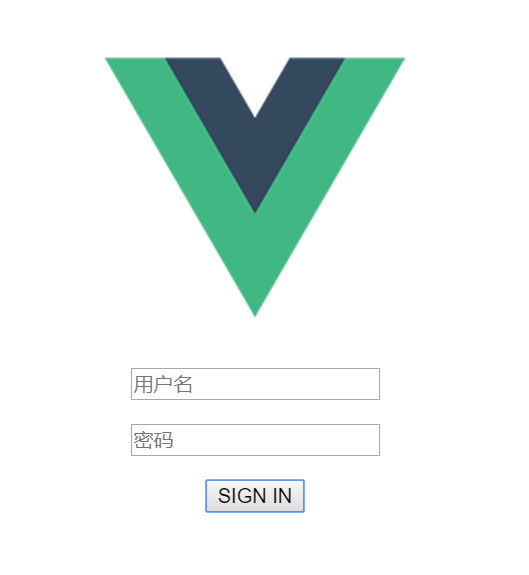

## 简单 web 服务与客户端开发实战
#### 概述
利用 web 客户端调用远端服务是服务开发本实验的重要内容。其中，要点建立 API First 的开发理念，实现前后端分离，使得团队协作变得更有效率。

#### 任务目标
1. 选择合适的 API 风格，实现从接口或资源（领域）建模，到 API 设计的过程
2. 使用 API 工具，编制 API 描述文件，编译生成服务器、客户端原型
3. 使用 Github 建立一个组织，通过 API 文档，实现 客户端项目 与 RESTful 服务项目同步开发
4. 使用 API 设计工具提供 Mock 服务，两个团队独立测试 API
5. 使用 travis 测试相关模块

#### 实现内容
本人参与实现前端的内容，使用vue.js框架实现客户端，进行前后端的交互。主要实现登入和登出两个界面。

#### vue.js框架介绍
Vue.js是一个开源JavaScript框架，能够开发单页面应用程序。它还可以用作Web应用程序框架，旨在简化Web开发。Vue.js应用程序开发引起了全球开发人员的极大关注，以构建令人惊叹的Web应用程序。Vue或Vue.js是一个用于为Web构建引人注目的UI的渐进式框架。它最初于2014年由前Google开发人员Evan You发布，他使用AngularJS并决定排除Angular框架的痛点并构建轻量级的东西。它的流行有很多原因，其中一个关键原因是它能够在没有任何动作的情况下重新渲染。它允许您构建可重用，小巧但功能强大的组件，因此，它提供了一个可组合的框架，允许您在需要时添加组件。

#### vue.js安装指南
#安装Vue命令行工具：
npm install --global vue-cli

#安装一个新项目：
npm install -g @vue/cli-init
vue init webpack my-project

安装依赖：
cd 项目所在的文件夹
npm install

#服务以热重载的方式运行在 localhost:8000（使用的端口可以在config/index.js处更改）：
npm run dev （可以在命令行处输入，但是建议使用HBuilder X软件打开）

#### 具体实现
一个vue文件由三部分组成，分别可以看作是html，script，css的内容。实现过程中使用了v-model命令，进行**视图－>数据**的绑定，获取用户输入的数据，并发往服务器，进行相应的处理。

实现代码具体如下：

登陆界面：

```
<template>
  <div id="login">
    <p>
      <input id="username" type="text" placeholder="用户名" v-model="usr"></input>
    </p>
    <p>
      <input id="password" type="text" placeholder="密码" v-model="psw"></input>
    </p>
    <p>
      <button v-on:click="post">SIGN IN</button>
    </p>
  </div>
</template>

<script>
export default {
  name: 'Signin',
  data: function() {
    return {
      usr: "",
      psw: ""
    };
  },
  methods: {
    post: function() {
      this.$http.post("/apis/login",
        {
          username:this.usr,
          password:this.psw
        },
        {
          withCredentials:true,
          emulateJSON: true
        }
        ).then(
        function(res) {
          if(res.ok) {
            this.$router.push({path:"/Search"});
          }
        },
        function() {
          alert("error");
        });
    },

  }
}
</script>
```

前后端分离调用涉及到跨域的问题，vue.js框架给出了proxyTable来帮助解决这个问题，通过设置代理，浏览器就不会再报错。具体代码如下：
```
  dev: {


    assetsSubDirectory: 'static',
    assetsPublicPath: '/',

    proxyTable: {
      '/apis': {
        target: 'http://localhost:8080',
        changeOrigin: true,
        pathRewrite: {
          '^/apis': 'http://localhost:8080'
          }
      },
        '/api': {
            changeOrigin:true,
            target:'localhost:3333',
            pathRewrite: {
                '^/api':'/api'
            }
        }
    },
```


登出界面：

```
<template>
  <div id="signout">
    <p>Sign out successfully</p>
    <p>
       <router-link to="/">Sign in</router-link>
     </p>
  </div>
</template>

<script>
  export default {
    name: 'Signout'
    }
</script>

```

通过`router-link`实现页面的跳转。需要先再`index.js`文件进行相应的设置，方可实现，具体代码如下：

```
import Vue from 'vue'
import Router from 'vue-router'
import HelloWorld from '@/components/HelloWorld'
import Signout from '@/components/Signout'
import Signin from '@/components/Signin'
import search from '@/components/search'

Vue.use(Router)

export default new Router({
  routes: [
    {
      path: '/',
      name: 'Signin',
      component: Signin
    },
    {
      path: '/Signout',
      name: 'Signout',
      component: Signout
    },
    {
      path: '/search',
      name: 'search',
      component: search
    }
  ]
})
```
#### 结果展示
只展示登陆界面的结果图，剩下的图可以在`assets`文件夹内查看。



#### 实验心得

在本次实验中，我负责的是前端内容的部分实现，这是我第一次尝试写有关前后端交互的代码实现，从前对此的了解并不多，所以这次实验对我来说一点都不简单。由于这次实验我们需要使用新的框架vue.js，我对其的了解其实并不多，所以我花了大量的时间去了解其内容，明白其架构的实现，各种其特有的命令，最后才能稍微利用其完成简单的页面实现，虽然花费许多，但是收获也不小。

在实验过程中，我遇到了许多问题，其中最令我印象深刻的是跨域问题。当前端页面与后台运行在不同的服务器时，就必定会出现跨域这一问题，而这个问题的解决也消耗了我许多的时间，网上资料给出的解决这个问题的方法都颇为复杂，还好vue.js框架保留一个简单的方式：设置代理，使得这个问题得以快速解决。

