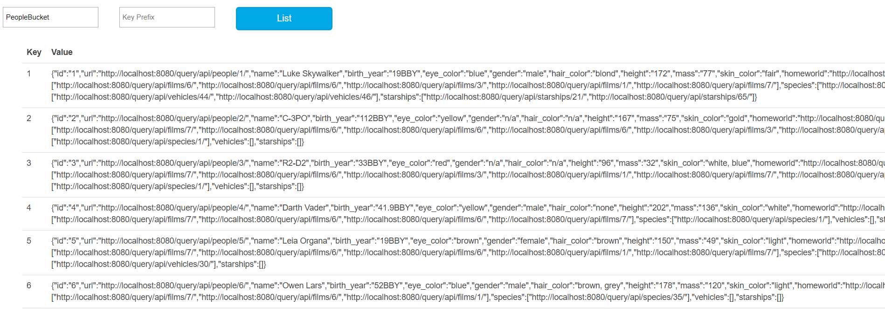

# SWAPI

[toc]

[完整项目地址]( https://github.com/Go-GraphQL-SYSU/GraphQL-Service )

[数据爬取分支]( https://github.com/Go-GraphQL-SYSU/GraphQL-Service/tree/crawler )

## 完整实验要求

> 复制 https://swapi.co/ 网站
>
> - 你需要想办法获取该网站所有资源与数据
> - 给出 UI 帮助客户根据明星查看相关内容

## 实验分工

在本次实验中，我负责的任务是从 https://swapi.co/ 网站爬取所有的数据，然后存入到数据库中

## 具体实现

### Model的建立

首先，我们参考 https://swapi.co/ 所有类型的json数据，然后根据需要来构建我们的结构体

以People为例

```json
{
	"name": "Luke Skywalker",
	"height": "172",
	"mass": "77",
	"hair_color": "blond",
	"skin_color": "fair",
	"eye_color": "blue",
	"birth_year": "19BBY",
	"gender": "male",
	"homeworld": "https://swapi.co/api/planets/1/",
	"films": [
		"https://swapi.co/api/films/2/",
		"https://swapi.co/api/films/6/",
		"https://swapi.co/api/films/3/",
		"https://swapi.co/api/films/1/",
		"https://swapi.co/api/films/7/"
	],
	"species": [
		"https://swapi.co/api/species/1/"
	],
	"vehicles": [
		"https://swapi.co/api/vehicles/14/",
		"https://swapi.co/api/vehicles/30/"
	],
	"starships": [
		"https://swapi.co/api/starships/12/",
		"https://swapi.co/api/starships/22/"
	],
	"created": "2014-12-09T13:50:51.644000Z",
	"edited": "2014-12-20T21:17:56.891000Z",
	"url": "https://swapi.co/api/people/1/"
}
```

那么，我们就在model中定义

> json解析结构体中对应的值的过程：
>
> 比如给定一个 JSON key Filed，它是这样查找的：
>
> 1. 首先查找 tag （ 通过`Tag`来增强结构体的定义，Tag会带上一些meta信息 ）名字为 Field 的字段
> 2. 然后查找名字为 Field 的字段
> 3. 最后再找名字为 Field 等大小写不敏感的匹配字段。
> 4. 如果都没有找到，就直接忽略这个 key，也不会报错。

```go
type People struct {
	ID        string   `json:"id"`
	Url       string   `json:"url"`
	Name      string   `json:"name"`
	BirthYear string   `json:"birth_year"`
	EyeColor  string   `json:"eye_color"`
	Gender    string   `json:"gender"`
	HairColor string   `json:"hair_color"`
	Height    string   `json:"height"`
	Mass      string   `json:"mass"`
	SkinColor string   `json:"skin_color"`
	HomeWorld string   `json:"homeworld"`
	Films     []string `json:"films"`
	Species   []string `json:"species"`
	Vehicles  []string `json:"vehicles"`
	Starships []string `json:"starships"`
}
```

### 爬取数据

首先，我们爬取数据，肯定需要http.client，所以需要对它实现封装

> DefaultClient is the default Client and is used by Get, Head, and Post.

所以一开始我是直接类似于net/http里的写法

```go
type Crawler struct {
	client *http.Client
}
// Get a crawler
func GetCrawler() *Crawler {
	return &Crawler{
		client: http.DefaultClient,
	}
}
```

但是写到后面的时候，觉得可以通过协程提高爬取的性能，但是如果使用的还是DefaultClient的话，一方面就失去实现多协程的意义，另一方面不利于client的自定义（实现超时等功能），所以做出修改

```go
type Crawler struct {
	client *http.Client
}

// Get a crawler using the default client
func GetCrawlerSync() *Crawler {
	return &Crawler{
		client: http.DefaultClient,
	}
}

// Get a crawler using a custom client
func GetCrawlerAsync(c *http.Client) *Crawler {
	return &Crawler{
		client: c,
	}
}
```

然后我们需要一个函数来发送请求和对返回的数据进行反序列化

```go
// Request method used by the crawler, while parsing the returned json data into v
func (c *Crawler) requestAndSave(u string, v interface{}) error {
	fmt.Println(u)
	res, err := c.client.Get(u)
	if err != nil {
		return err
	}
	defer func() {
		if err := res.Body.Close(); err != nil {
			log.Printf("Error when close response:%s\n", err)
		}
	}()

	return json.NewDecoder(res.Body).Decode(v)
}
```

最后就是分别对people / starships / planets / vehicles / films / species

> 可到  https://swapi.co/api/  获取所有类别对应的api

具体爬取的步骤（以people为例）

1. 向  https://swapi.co/api/people/  发出GET请求，我们会获得以下json数据

   ```json
   {
       "count": 87, 
       "next": "https://swapi.co/api/people/?page=2", 
       "previous": null, 
       "results": [
           {  people1 },{ people2 }……
       ]
   ```

2. 我们所需要的是其中的next和results数据，next用来告诉我们是否有下一页需要爬取，所以我们需要创建一个结构体来保存上述两个数据

   > 这里的next需要用*string来保存，因为next如果为空是null，而在反序列中，string对应值如果为null，则跳过该field，而用\*string的话，就会转化为nil

3. 将上述结构体中保存的每一页的results append到一个切片中，用以保存所有数据

4. 最后对数据进行处理，比如补全ID，将`swapi/api`转为`localhost:8080/request`

   ```go
   func (c *Crawler) getPeopleInfo() ([]People, error) {
   	peopleInfo := struct {
   		Next   *string  `json:"next"`
   		Person []People `json:"results"`
   	}{}
   	requestURL, err := composeUrl("people")
   	if err != nil {
   		return nil, err
   	}
   
   	var people []People
   	for {
   		err = c.requestAndSave(requestURL, &peopleInfo)
   		if err != nil {
   			return nil, err
   		}
   
   		people = append(people, peopleInfo.Person...)
   
   		if peopleInfo.Next == nil {
   			break
   		}
   		requestURL = *peopleInfo.Next
   	}
   
   	for key := range people {
   		people[key].ID = getIDFormUrl(people[key].Url)
   		replaceSingleOldString(&people[key].HomeWorld)
   		replaceSingleOldString(&people[key].Url)
   		replaceOldString(people[key].Starships)
   		replaceOldString(people[key].Vehicles)
   		replaceOldString(people[key].Films)
   		replaceOldString(people[key].Species)
   	}
   
   	fmt.Println(people)
   	return people, nil
   }
   ```

### 存入数据库

这里我们使用的数据库是 [boltdb——An embedded key/value database for Go.]( https://github.com/boltdb/bolt )

存入的操作很简单，根据 所需要存入的bucket以及对应的key-value键值对，直接在db.Update中找到对应的bucket指针（防止bucket不存在，所以我们使用CreateBucketIfNotExists），然后对bucket进行put操作即可

```go
// Write key-[] byte key-value pairs to a bucket named bucket
func writeToDB(db *bolt.DB, bucket, key string, data []byte) error {
	return db.Update(func(tx *bolt.Tx) error {
		b, err := tx.CreateBucketIfNotExists([]byte(bucket))
		if err != nil {
			return err
		}
		return b.Put([]byte(key), data)
	})
}
```

### 组合

将上述功能整合起来，就是我本次所负责的爬取数据任务

通过协程来完成各种操作，这里我使用官方推荐的 sync.WaitGroup 来实现阻塞等待

```go
func ScrapAndSave() {
	// Open the db data file in your current directory.
	// It will be created if it doesn't exist.
	db, err := bolt.Open(dbPath, dbMode, nil)
	if err != nil {
		log.Fatalf("Error when open bolt database:%s\n", err)
	}
	defer func() {
		if err := db.Close(); err != nil {
			log.Printf("Error when close the database:%s\n", err)
		}
	}()

	wg := sync.WaitGroup{}
	wg.Add(6)

	go func() {
		people, err := GetCrawlerAsync(&http.Client{}).getPeopleInfo()
		if err != nil {
			log.Printf("Error when crawl people info:%s\n", err)
			wg.Done()
			return
		}
		for _, val := range people {
			jsonData, err := json.Marshal(val)
			if err != nil {
				log.Printf("Error when marshal json (people):%s\n", err)
				continue
			}

			if err := writeToDB(db, PeopleBucket, val.ID, jsonData); err != nil {
				log.Printf("Error when write jsondata to db (people):%s\n", err)
				continue
			}
		}
		wg.Done()
	}()
    go func(){
       …… 
    }()
```

### 结果查看

这里我们通过一个小工具来查看我们的db文件 [boltdbweb A web based GUI for BoltDB files]( https://github.com/evnix/boltdbweb )




基本符合预期

## 总结

虽然本次实验我所负责的功能与我们最后实现的服务端关系不大，但是这次试验却让我对协程/数据库处理/http.Client有了更深的了解，因为之前的实验中基本没有使用/实现过上述三种功能，毕竟之前的实验更多的是http.Server相关的操作，基本上都是同步处理，涉及数据的为了简便，用的都是map来存储数据（比如上一次的rest api开发）。

这也是第一次小组合作完成前后端的开发，在与小组成员划分分工/讨论接口以及如何相互配合解决问题的过程中，也是收获很大。